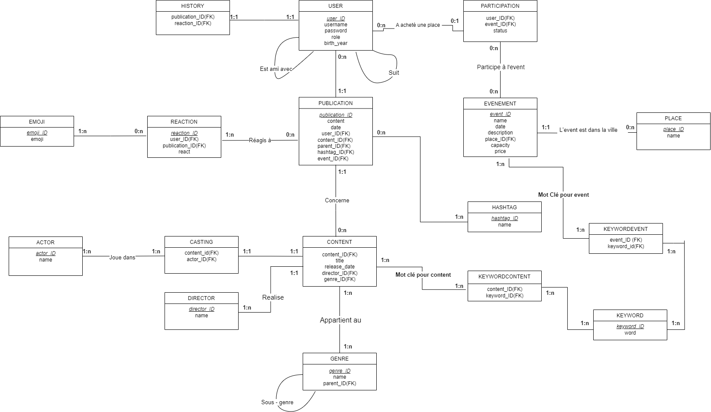

# Rapport de Projet : Création d'une Base de Données pour un Réseau Social de Cinéphiles

## Introduction

Ce rapport présente le projet réalisé dans le cadre de la matière "Base de Données". L'objectif était de concevoir et développer une base de données pour un réseau social destiné aux cinéphiles. Les utilisateurs de ce réseau peuvent se suivre mutuellement, publier des contenus relatifs à des événements cinématographiques, réagir et commenter des publications. Un historique personnalisé est également maintenu pour chaque utilisateur. Ce projet a été réalisé en binôme, et nous avons travaillé ensemble sur toutes les phases, de la conception initiale à l'implémentation finale.

## Description du Sujet

Le sujet du projet consistait à créer une base de données pour un réseau social de cinéphiles avec les fonctionnalités suivantes :
- Les utilisateurs peuvent se suivre, soit de manière unidirectionnelle, soit de manière bidirectionnelle.
- Les utilisateurs peuvent poster des publications liées ou non à des événements cinématographiques.
- Les publications peuvent recevoir des réactions et des commentaires d'autres utilisateurs.
- Chaque utilisateur dispose d'un historique personnel des publications et des réactions.

## Méthodologie

### Équipe et Rôles

Nous étions deux à travailler sur ce projet. Nous avons collaboré à toutes les étapes du projet, de la conception initiale du schéma entité-association (EA) à l'écriture des requêtes SQL et la mise en œuvre des algorithmes de recommandation.

### Outils Utilisés

Nous avons utilisé les outils et logiciels suivants pour mener à bien ce projet :
- **Développement de la base de données :** MySQL
- **Peuplement des tables :** Script Python avec la bibliothèque `faker`

### Évolution des Schémas EA

Nous avons développé notre projet en trois étapes principales, chacune représentée par un schéma EA :

    1. **Premier Schéma :** Une première ébauche réalisée rapidement pour visualiser la structure de la base de données.


    2. **Deuxième Schéma :** Une version plus détaillée et structurée, basée sur le premier schéma et les idées développées par la suite.


1. **Troisième Schéma :** La version finale optimisée après avoir identifié des problèmes d'optimisation lors de la création des premières requêtes.



### Structure des Tables

Nous avons créé un total de 19 tables. Les tables les plus importantes sont :

- **Publication :** Représente les publications des utilisateurs, y compris le contenu, la date de publication, et les références aux publications parent.
- **Événement :** Détaille les événements cinématographiques, y compris le nom, la description, la date, le lieu, le prix, et le nombre de places disponibles.
- **Content :** Inclut des informations sur les films, séries, et autres contenus cinématographiques.

### Peuplement des Tables

Pour peupler nos tables, nous avons utilisé un script Python s'appuyant sur la bibliothèque `faker` pour générer des données fictives. Cela nous a permis de tester et valider les requêtes et algorithmes avec un jeu de données réaliste.

## Requêtes SQL

### Exemple de Requête

Une de nos requêtes avec condition de totalité avec agrégation est la suivante :

```sql
SELECT u.username
FROM USER u
JOIN REACTION r ON u.user_ID = r.user_ID
GROUP BY u.username
HAVING COUNT(CASE WHEN r.reaction_ID = 1 THEN 1 ELSE NULL END) = 0;
```

Cette requête permet de sélectionner les utilisateurs qui n'ont jamais réagi avec une certaine réaction.

## Algorithmes de Recommandation

Nous avons développé trois algorithmes de recommandation. Un exemple d'algorithme est celui qui calcule la note de recommandation d’un événement en utilisant une notation précise :

```sql
SELECT e.event_ID, e.name,
    (COUNT(p.user_ID) * 0.4 + 
    COUNT(DISTINCT h.event_ID) * 0.3 + 
    IF(e.place_ID IN (SELECT place_ID FROM USER WHERE user_ID = :current_user_id), 0.3, 0)) AS recommendation_score
FROM EVENT e
LEFT JOIN PARTICIPATION p ON e.event_ID = p.event_ID
LEFT JOIN HISTORY h ON e.event_ID = h.event_ID AND h.user_ID = :current_user_id
WHERE p.user_ID IN (
    SELECT friend_user_ID 
    FROM FRIENDS 
    WHERE user_ID = :current_user_id
) OR e.place_ID IN (SELECT place_ID FROM USER WHERE user_ID = :current_user_id)
GROUP BY e.event_ID, e.name
ORDER BY recommendation_score DESC
LIMIT 10;
```

Cet algorithme utilise plusieurs critères pour calculer un score de recommandation pour les événements, en tenant compte des participations des amis de l'utilisateur, de l'historique de l'utilisateur, et du lieu de l'événement.

## Résultats et Conclusions

Ce projet nous a permis de mieux comprendre les enjeux de la conception et de l'optimisation d'un schéma de base de données dans un contexte réel. Nous avons appris à créer des schémas EA détaillés, à peupler des tables avec des données réalistes, à écrire des requêtes SQL complexes avec des contraintes, et à développer des algorithmes de recommandation efficaces.

### Défis Rencontrés

L'un des principaux défis a été de comprendre et de mettre en œuvre des algorithmes de recommandation pertinents. Cependant, avec de la pratique et de la recherche, nous avons réussi à développer des algorithmes efficaces.

### Améliorations Futures

À l'avenir, nous pourrions envisager d'ajouter des fonctionnalités supplémentaires, telles que la possibilité pour les utilisateurs de noter des films et des événements, et d'intégrer des algorithmes de machine learning pour améliorer les recommandations.

## Conclusion

En conclusion, ce projet a été une expérience d'apprentissage précieuse qui nous a permis d'acquérir des compétences pratiques en conception de bases de données, en écriture de requêtes SQL et en développement d'algorithmes de recommandation. Nous avons également appris l'importance de l'optimisation et de la structuration efficace des schémas de base de données pour assurer des performances optimales.

